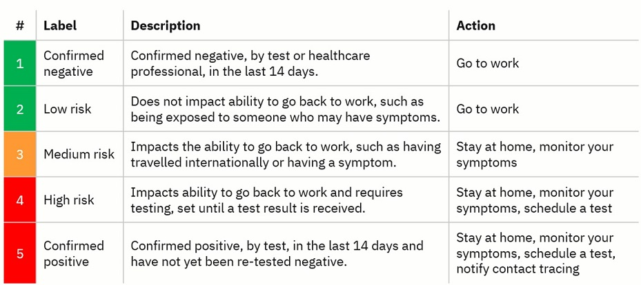
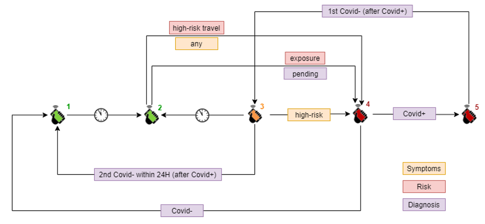

This document provides a brief description of each repo and what it contains, broken down by:
* DHP Platform
* DHP Verifier & Wallet Applications
* Data Exchange Service (DES)
* Test & Configuration
* Samples
* Salesforce

# DHP Platform
These repos are related to core services of the DHP cloud platform, such as authentication, metering, logging, issuing, and verification.

## dhp-api
This API handles all the capabilities required for issuance of credentials, from managing schemas to issuing and revoking of credentials.

## dhp-generic-issuer-api
This API handles all capabilities required for managing the Trust Registry, which acts as a list of trusted issuers and their associated keys, DID documents, and other relevant information. It provides integrations with two other trust registries; Vaccine Credential Initiative Trust Registery (for Smart Health Cards, SHCs) and the EU Gateway (for Digital Covid Certificates, DCCs). 

## dhp-verify-admin-api
This API is used by the verifier admin UI for verifier onboarding and configuration.

## dhp-verify-admin-ui
This is the verifier admin UI that allows administrators for verifying organizations to log-in and manage their verifier apps, which includes setting up verifier access controls/credentials and configuring the behavior of each verifier, such as the types of credentials accepted and the rules governing the verification logic. They can review their verifier metrics and billing.

## dhp-verify-config-api
This API is used by the verifier admin UI during the verifier configuration process, and by the verifier applications so that they can retrieve their configuration information and setup the correct verification logic.

## dhp-verify-metering-api
This allows the verifier application to send anonymous metrics, such as the number of verifications performed for each issuing organization, so that verifying organizations can have some visibility on verifications without getting any personally identifible information, such as who or what credentials were verified. The verifier administration web UI allows the verifying organization to log-in, manage  and configure their verifier apps, and see verifier metrics.

## dhp-auth-lib (TO BE COMPLETED)
This library  abstraction layer for both appID and keycloak ... for token

## dhp-http-lib
This library provides common HTTP functionality, such as retry, correlation headers, etc.

## dhp-logging-lib
This library provides common logging capablities for the DHP platform.

# DHP Verifier & Wallet Applications

DHP comprises two applications; a digital wallet for holding credentials and a verifier application for verifying them. The digital wallet is only available for mobile devices, specifically Android or iOS, whereas the verifier application is also available for web, with both nodejs and python versions. Check out the [README](./README.md) for more details on the wallet and verifier capabilities. These repos are related to the wallet and verifier applications.

## dhp-cache-lib
This provides general purpose caching capabilities for the nodejs verifier application.

## dhp-verify-nodejs-lib
This is an extensible library for use by Digital Health Pass users that want to verify several types of credentials, where the credential verifiers are referred to as plug-ins. If this library does not contain a verifier plug-in for a given type of credential, then you can create a custom plug-in and pass it to the library. The following plug-ins are available: Digital Health Pass and Good Health Pass (idhp-verifier), EU Digital COVID Certificate (eu-dcc-verifier), and SMART Health Cards (vci-verifier). This is the nodejs implementation

## dhp-verify-python-lib
This is the python verifier extensible library (described above).

## dhp-android-app
This is the android verifier and wallet applications, natively written in Kotlin.

## dhp-ios-app
This is the iOS verifier and wallet applications, natively written in Swift.

# Data Exchange Service (DES)
There are two ways that credentials can currently be exchanged in DHP. 

* **QR Code scanning** which allows the person present a QR Code to a verifying individual, which they can scan with their verifier application. This has one major limitation, in that it requires in-person credential exchange.
  
* **Data exchange service (DES)** which allows the person to exchange credentials across the Internet.

DES was designed to fast-track adoption of verifiable credentials by providing easy integration into existing business processes and systems. On the one side, it is integrated into the DHP wallet to make it easy for an individiual to share credentials electronically. On the other side, it includes capabilities to allow organizations to offload the physical process of credentialing and instead share data in the formats they already support, such as FHIR, CSV, XML, etc. It also includes configurable registration processes allowing pairwise identities to be anchored to the digital wallet enabling trusted data exchange between Issuer and Holder, Holder and Verifier. 

DES is an end-to-end flow from onboarding organizations to handling invitations to register, configurable registration flow, identity verification, ID issuance, cryptographic key handling, PO Box setup, signing of consent, and eventual transmission of credentials and associated consent receipts. These repos are related to DES.

## dhp-des-api
This API handles all the DES processing; from the holder sharing their credential from their wallet to the enterprise consuming the data once verified.

## dhp-notification-lib
This handles registration invitations from an organization to a wallet holder, supporting both SMS, using Amazon AWS SMS Service, and Email notifications.

## dhp-postbox-api
The PO Box, which is used by the data exchange service, is a secure, encrypted, personal cloud data vault for exchanging data with a registered individual. The URL, passcode, and encryption keys associated with the PO Box are tied to the holder’s digital wallet and the validated connection they created during registration. PO Boxes can be used to exchange data between an individual and the wallet holder, in a simple and secure, way.

# Test & Configuration
These repos are all related to the testing and configuration of the DHP system.

## dhp-data
This contains credential schemas, credential verification configurations with verifier rules, and other data related to configuration as well as test data templates and test scripts for automation of DHP testing.

# Samples
These repos are related to sample or experimental code, or code that was written for a specific use case and not broadly deployed.

## sample-dhp-challenge-api
The challenge API provides a mechanism whereby the verifier can generate a challenge, convert to a QR Code, and present to an individual, who can then scan the QR Code from their digital wallet. The digital wallet generates a response, converts to a QR Code that they present to the verifier so they can scan and verify. This challenge process, adds an extra level of security and identity verification for any credentials presented, since the response mechanism is signed using the secret key corresponding to the public key issued with their identity credential. It is dependent on the digital wallet having support for the management of secret/public key pairs during ID credential issuance, which happens during the registration process supported through the "Data Exchange Service". 

## sample-dhp-wellness-score-api

The wellness score API provide a mechanism whereby an organization can incorporate personal data into a business process without exposing the underlying data or the logic by which it was generated. For example; an organization implementing a return to work policy might want to generate a wellness score which is then used by the business process so that the underlying health data used to generate the score does not need to be exposed. A sample wellness score model is contained in this repo, with the following states:

The wellness score is underpinned by a state transition model that allows changes in underlying risk factors to modify the health pass in order to drive a business process, such as providing building access, coordinating a Covid test, organizing sick leave, allowing to work from home, etc. The underlying data (and business logic) is not exposed to all parts of the business, instead it’s on a need to know basis. So the security guard only needs to know is whether the health pass is green or red, and does not need to ask for test results, temperature readings, exposure notifications, symptom checks, or any of the other data points that may have contributed to the status.

Similarly, with an airline looking to introduce a health pass before boarding a plan. The airline can leverage rules defined by an official government agency, which define what a low-risk Covid status might be. For example; it might factor in certain types of trusted tests, a duration for which the test result is valid, certain types of vaccinations, vaccination status, and duration. The airline just needs to ensure that only green health passes board the plan and the traveller only needs to expose their health pass status to the airline.

## dhp-des-admin-ui
This application was designed to fast-track adoption of verifiable credentials by issuing organizations, specifically Covid testing companies, providing a simple mechanism through which they could upload test results and DES would handle patient registration, identity verification, and subsequent issuing of the test credential. 

## sample-dhp-enterprise-api
This API handles analysis and reporting capabilities for employers looking to manage return to work policies through verification of vaccination or test credentials. 

## sample-dhp-holder-web-ui (TO BE COMPLETED)
What is this exactly?

# Salesforce
These repos are related to the DHP-Salesforce integration.

## salesforce-dhp-connector
This is the Mulesoft Connector that is used for Salesforce integrations with Digital Health Pass issue and verify.

## salesforce-dhp-issuer-app
This contains resources & documentation to help you complete integration of the issuer capabilities into Salesforce.

## salesforce-dhp-verify-app
This contains resources & documentation to help you complete integration of the verifier capabilities into Salesforce.
